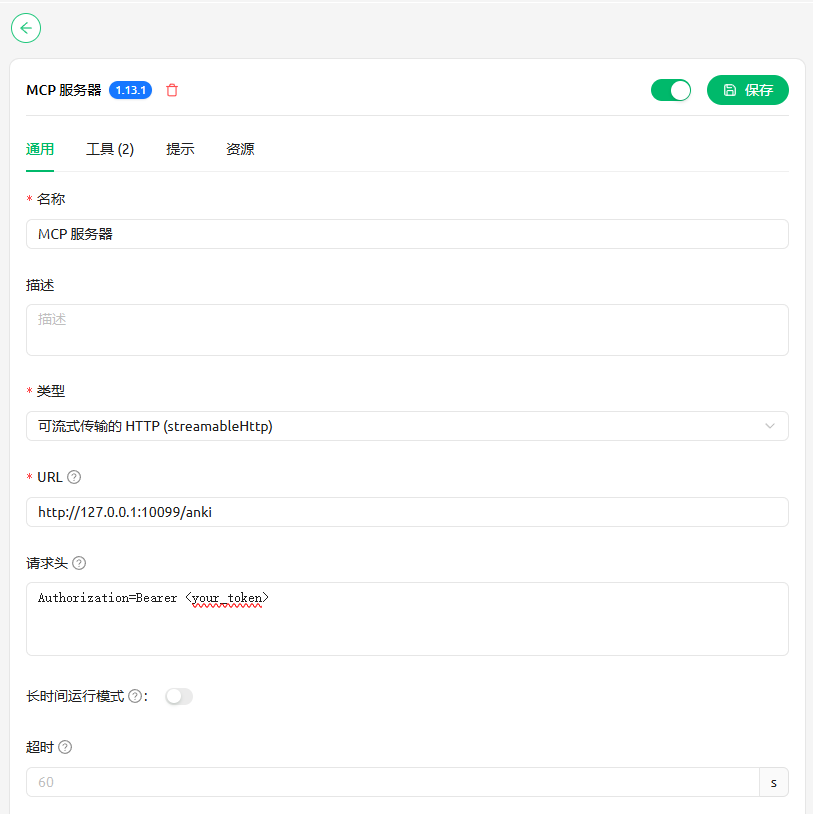
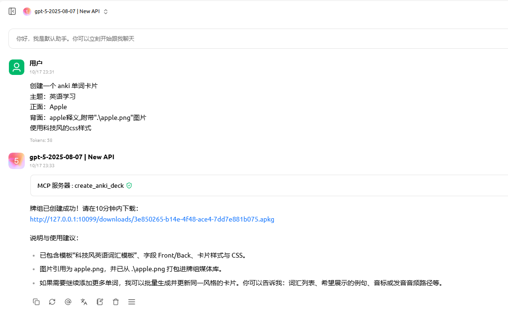

# genanki-mcp

Automated Anki deck generation service built with [genanki](https://github.com/kerrickstaley/genanki) and the [Model Context Protocol (MCP)](https://modelcontextprotocol.io/).  
Focuses on dependable deck creation, strict media sandboxing, and keeping the workflow lean—nothing more.

[中文文档](README.zh-CN.md)

## Highlights

- Streamable MCP HTTP tool that plugs into any MCP-compliant client
- Agents can craft rich CSS templates and embed media assets safely
- Temporary download links (default expiry 600 seconds) for `.apkg` retrieval
- Media path sandbox prevents out-of-scope file access and orphaned assets

## Project Layout

```
anki_mcp/
├── anki_tools/           # genanki utility wrapper
│   └── genanki_tool.py
├── server/               # MCP + HTTP entrypoints
│   ├── anki_models.py    # Pydantic request/response models
│   └── anki_server.py    # FastMCP / Starlette server
├── temp_anki_decks/      # Temporary .apkg exports
├── .envexample           # Environment variable template
├── pyproject.toml        # uv / pip project definition
└── uv.lock
```

## Quick Start

```bash
git clone https://github.com/Epiphany-0312/genanki-mcp.git
cd genanki-mcp
```

### Requirements

- Python ≥ 3.13
- Dependency management via [uv](https://github.com/astral-sh/uv) (recommended) or `pip`

### Install Dependencies

```bash
# With uv (recommended)
uv sync

# Or with pip
python -m venv .venv
.venv\Scripts\activate  # PowerShell
pip install -r requirements.txt
```

### Configure Environment Variables

Duplicate `.envexample` to `.env` and adjust as needed.

| Variable    | Description                                    | Default      |
| ----------- | ---------------------------------------------- | ------------ |
| `PORT`      | Uvicorn/FastMCP listening port                 | `10099`      |
| `SREVERIP`  | Public IP/host used to compose download links  | `127.0.0.1`  |
| `TOKEN`     | Optional bearer token protecting tool access   | (empty)      |

If `TOKEN` is omitted, the service skips authentication. Set it in production environments.

## Run the Service

```bash
uv run python -m server.anki_server
# or
python -m server.anki_server
```

FastMCP exposes the tool at `http://0.0.0.0:<PORT>/anki` and temporary downloads at `http://0.0.0.0:<PORT>/downloads`.

## Usage

Connect with any MCP-capable client. By default the MCP endpoint listens on `http://127.0.0.1:10099/anki`.

Cherry Studio example configuration and workflow:






## License

MIT License
