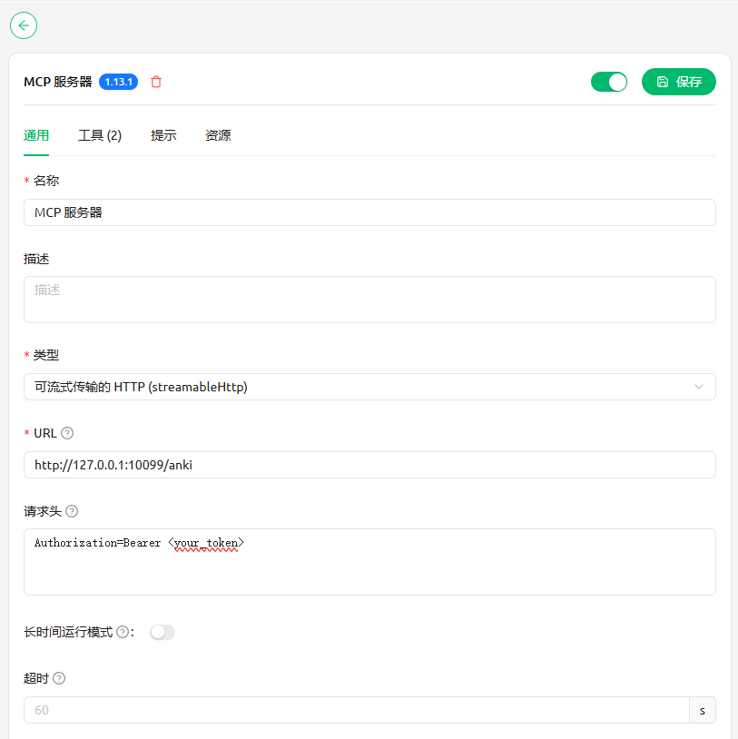
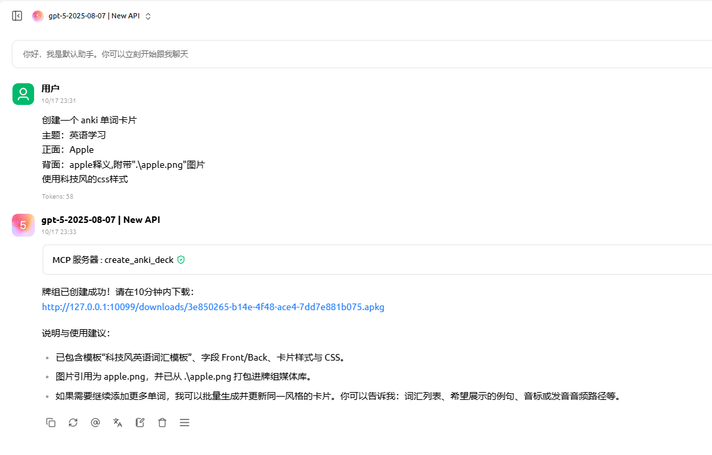
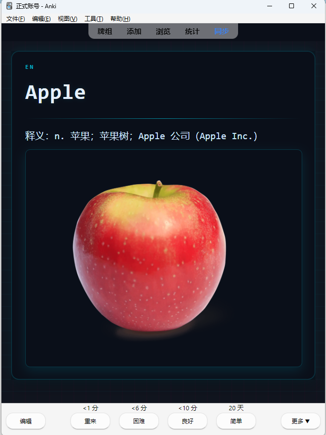

# genanki-mcp

一个基于 [genanki](https://github.com/kerrickstaley/genanki) 和 [Model Context Protocol (MCP)](https://modelcontextprotocol.io/) 的自动化制卡服务。该项目提供：

[English README](README.md)

- 提供一个`streamable_http`的mcp工具，可被任何符合 MCP 规范的客户端调用。
  
- 用户可以将需要添加到卡组的媒体文件添加到程序工作目录下，并用提示词告诉llm媒体路径（相对路径），即可将媒体文件添加至卡组内。

> 项目遵循 “够用即可” 的思路（KISS & YAGNI），仅聚焦在可靠创建牌组、限制媒体路径、防止临时文件堆积等核心需求。

## 功能特点

- 可由agent制定复杂css样式，允许嵌入媒体文件
- 自动生成临时下载链接（默认 600 秒过期），支持外部系统拉取 `.apkg`。
- 媒体文件路径沙盒校验，避免越界访问与遗漏。

## 目录结构

```
anki_mcp/
├── anki_tools/           # genanki 封装工具
│   └── genanki_tool.py
├── server/               # MCP + HTTP 服务
│   ├── anki_models.py    # Pydantic 请求/响应模型
│   └── anki_server.py    # FastMCP / Starlette 入口
├── temp_anki_decks/      # 生成的临时 .apkg 文件
├── .envexample           # 环境变量示例
├── pyproject.toml        # uv / pip 构建信息
└── uv.lock
```

## 快速开始

### 运行环境

- Python ≥ 3.13
- 推荐使用 [uv](https://github.com/astral-sh/uv) 或 `pip` 管理依赖

### 安装依赖

```bash
# 使用 uv（推荐）
uv sync

# 或使用 pip
python -m venv .venv
.venv\Scripts\activate  # PowerShell
pip install -r requirements.txt
```

### 配置环境变量

复制 `.envexample` 为 `.env` 并根据需要调整。

| 变量名     | 说明                                    | 默认值      |
| ---------- | --------------------------------------- | ----------- |
| `PORT`     | Uvicorn/FastMCP 监听端口                | `10099`     |
| `SREVERIP` | 用于拼接下载链接的对外地址（服务器ip）  | `127.0.0.1` |
| `TOKEN`    | 可选的 Bearer Token，保护服务端工具调用 |             |

若不提供 `TOKEN`，服务将跳过鉴权；生产环境请务必设置并妥善保存。

## 启动服务

```bash
uv run python -m server.anki_server
# 或
python -m server.anki_server
```

启动成功后，FastMCP 会在 `http://0.0.0.0:<PORT>/anki` 暴露工具接口，同时在 `http://0.0.0.0:<PORT>/downloads` 暴露临时文件目录。

## 如何使用

使用支持mcp的客户端即可,mcp服务默认监听在`http://127.0.0.1:10099/anki`

以下是一个cherry studio的配置和使用示例截图:







## 许可证

MIT 许可
